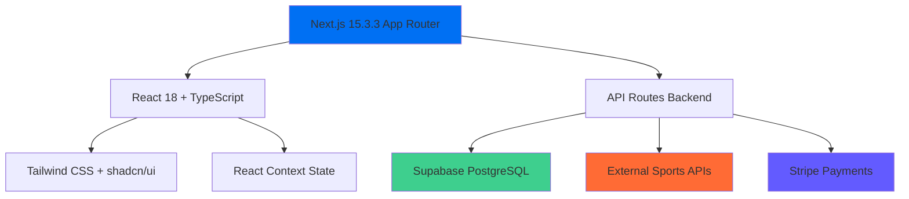
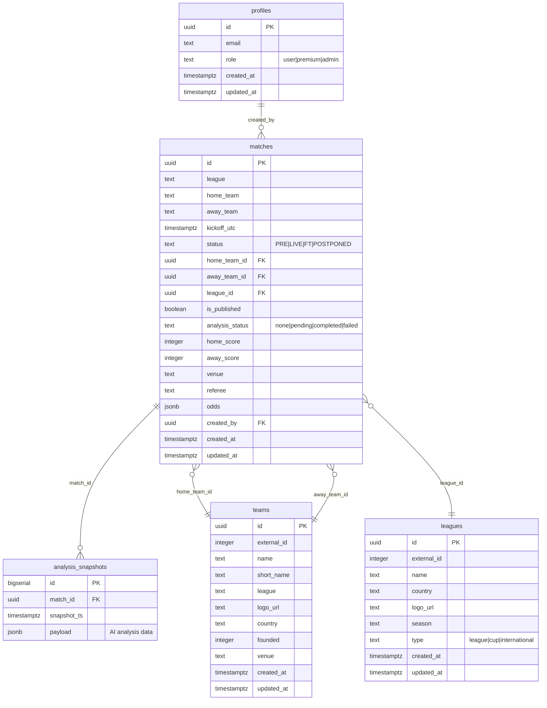
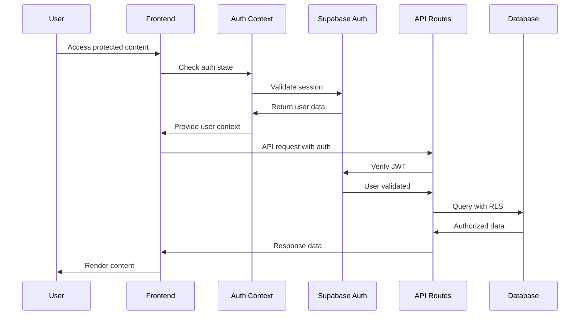
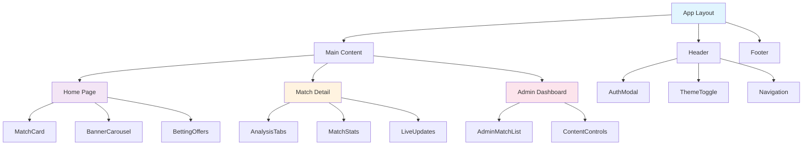
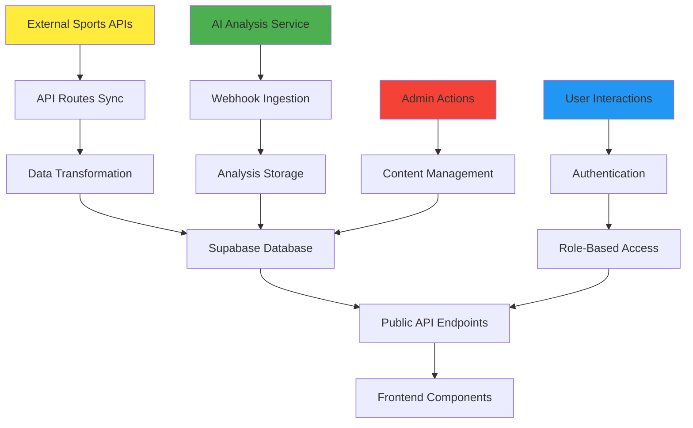
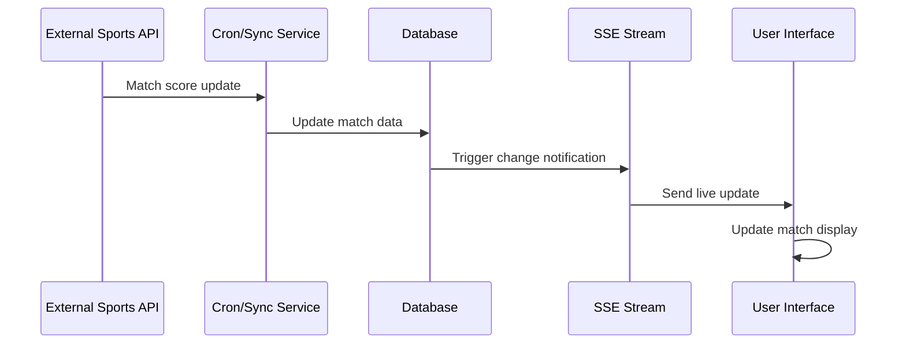

# BetHub - Complete System Analysis & Documentation

## Table of Contents
1. [System Architecture Overview](#system-architecture-overview)
2. [Database Schema & Domain Model](#database-schema--domain-model)
3. [Complete API Reference](#complete-api-reference)
4. [Authentication & Authorization](#authentication--authorization)
5. [External Integrations](#external-integrations)
6. [Frontend Architecture](#frontend-architecture)
7. [Data Flow Diagrams](#data-flow-diagrams)
8. [Postman Testing Guide](#postman-testing-guide)
9. [Environment Setup](#environment-setup)
10. [Current System Status](#current-system-status)

---

## System Architecture Overview

**BetHub is a monolithic Next.js 15 full-stack application** that combines a football betting insights platform with AI-powered analysis capabilities.

### Tech Stack Summary


**Key Characteristics:**
- **Monolithic Architecture**: Single Next.js app serving both frontend and backend
- **No Separate Backend**: API routes within Next.js handle all backend logic
- **Database**: Supabase (hosted PostgreSQL) with Row Level Security
- **Deployment**: Vercel (inferred from build configurations)

---

## Database Schema & Domain Model

### Core Tables Structure



### Domain Model Explained

**Core Entities:**
1. **Profiles**: User management with role-based access control
2. **Matches**: Central entity containing all match information
3. **Analysis Snapshots**: AI-generated insights stored as JSONB payloads
4. **Teams**: Normalized team data from external APIs
5. **Leagues**: Competition/league information

**Key Relationships:**
- Users create and manage matches (admin workflow)
- Matches have multiple analysis snapshots over time
- Teams and leagues are normalized references from external APIs

---

## Complete API Reference

### Public Endpoints (`/api/v1/`)

#### Match Data Endpoints

**`GET /api/v1/today`**
- **Purpose**: Fetch today's matches with external API integration
- **Response**: Array of match objects with logos and basic info
- **Auth**: None required
- **Data Source**: Football-Data.org + Sports-API fallback

**`GET /api/v1/match/[id]`**
- **Purpose**: Individual match details with analysis
- **Parameters**: `id` (UUID or external ID like `fd-12345`)
- **Response**: Match object with analysis data
- **Auth**: Premium required for full analysis
- **Fallback**: External API if not in database

**`GET /api/v1/match/[id]/stream`**
- **Purpose**: Server-Sent Events for real-time match updates
- **Response**: SSE stream with live score updates
- **Auth**: None required
- **Content-Type**: `text/event-stream`

#### System Endpoints

**`GET /api/v1/health`**
- **Purpose**: System health check and diagnostics
- **Response**: Memory usage, uptime, database status
- **Auth**: None required

**`GET /api/v1/test`**
- **Purpose**: Development testing endpoint
- **Response**: Environment information
- **Auth**: None required

**`GET /api/v1/test-real-data`**
- **Purpose**: Test external API integrations
- **Response**: Raw API response data
- **Auth**: None required

#### Data Sync Endpoints

**`GET /api/v1/sync-matches`**
- **Purpose**: Manual match synchronization from external APIs
- **Response**: Sync results and match count
- **Auth**: Admin required

**`POST /api/v1/ingest/analysis`**
- **Purpose**: Webhook for external AI analysis ingestion
- **Body**: Analysis payload with match ID
- **Headers**: `Authorization: Bearer INTERNAL_API_KEY`
- **Response**: Success confirmation

#### Utility Endpoints

**`GET /api/v1/unsplash`**
- **Purpose**: Fetch contextual images for matches
- **Query**: `query` parameter for search terms
- **Response**: Image URLs and metadata
- **Auth**: None required

### Admin Endpoints (`/api/v1/admin/`)

#### Match Management

**`GET /api/v1/admin/matches`**
- **Purpose**: List all matches with admin metadata
- **Response**: Paginated match list with analysis status
- **Auth**: Admin required

**`POST /api/v1/admin/matches`**
- **Purpose**: Create new match manually
- **Body**: Match details object
- **Auth**: Admin required

**`GET /api/v1/admin/matches/[id]`**
- **Purpose**: Admin view of individual match
- **Response**: Full match data with admin controls
- **Auth**: Admin required

**`PUT /api/v1/admin/matches/[id]`**
- **Purpose**: Update match details
- **Body**: Updated match fields
- **Auth**: Admin required

**`DELETE /api/v1/admin/matches/[id]`**
- **Purpose**: Delete match and related data
- **Auth**: Admin required

**`POST /api/v1/admin/matches/[id]/toggle-publish`**
- **Purpose**: Toggle match publication status
- **Body**: `{ "isPublished": boolean }`
- **Auth**: Admin required

**`POST /api/v1/admin/matches/[id]/analyze`**
- **Purpose**: Trigger AI analysis for specific match
- **Response**: Analysis initiation confirmation
- **Auth**: Admin required

#### Content Management

**`POST /api/v1/admin/spotlight-match`**
- **Purpose**: Feature a match in spotlight/banner
- **Body**: `{ "matchId": "uuid" }`
- **Auth**: Admin required

**`GET /api/v1/admin/analysis/[matchId]`**
- **Purpose**: Retrieve analysis data for admin review
- **Response**: Analysis snapshots with metadata
- **Auth**: Admin required

#### System Operations

**`GET /api/v1/admin/autonomous-sync`**
- **Purpose**: Check autonomous sync pipeline status
- **Response**: Pipeline status and configuration
- **Auth**: Admin required

**`POST /api/v1/admin/autonomous-sync`**
- **Purpose**: Control autonomous sync pipeline
- **Body**: `{ "action": "start|stop|restart" }`
- **Auth**: Admin required

**`POST /api/v1/admin/sync-data`**
- **Purpose**: Manual data synchronization from all sources
- **Response**: Sync results across all providers
- **Auth**: Admin required

### Payment Endpoints (`/api/payments/`)

**`POST /api/payments/checkout`**
- **Purpose**: Create Stripe checkout session for premium upgrade
- **Body**: `{ "userId": "uuid", "email": "string" }`
- **Response**: Checkout session URL
- **Auth**: User required

**`POST /api/payments/webhook`**
- **Purpose**: Stripe webhook handler for payment events
- **Headers**: `stripe-signature` for webhook verification
- **Events**: `checkout.session.completed`, `customer.subscription.deleted`
- **Side Effects**: Updates user role in profiles table

### Cron/Automation Endpoints

**`POST /api/cron/autonomous-sync`**
- **Purpose**: Scheduled synchronization trigger (Vercel Cron)
- **Auth**: Internal/scheduled only
- **Frequency**: Configurable in vercel.json

---

## Authentication & Authorization

### Authentication System Architecture



### Role-Based Access Control

**Roles in System:**
1. **Anonymous**: Public match viewing only
2. **User**: Authenticated, limited premium content
3. **Premium**: Full AI analysis access, betting insights
4. **Admin**: Full system control, content management

**Role Enforcement:**
- **Frontend**: Conditional rendering based on user role
- **API Routes**: Server-side role validation
- **Database**: Row Level Security policies
- **Payments**: Stripe webhook updates user roles

### Implementation Details

**Frontend Auth Context** (`src/contexts/AuthContext.tsx`):
```typescript
interface AuthContextType {
  user: User | null
  profile: UserProfile | null
  signIn: (email: string) => Promise<void>
  signOut: () => Promise<void>
  loading: boolean
}
```

**Profile Structure**:
```typescript
interface UserProfile {
  id: string
  email: string
  role: 'user' | 'premium' | 'admin'
  created_at: string
  updated_at: string
}
```

---

## External Integrations

### Sports Data Providers

#### 1. Football-Data.org (Primary)
- **Endpoint**: `https://api.football-data.org/v4/`
- **API Key**: `FOOTBALL_DATA_API_KEY`
- **Rate Limits**: 10 requests/minute, 10 requests/day (free tier)
- **Competitions**: PL, CL, EL, BL1, SA, FL1, PD
- **Data**: Live scores, match schedules, team info, league standings

#### 2. API-Sports via RapidAPI (Secondary)
- **Endpoint**: `https://api-sports.io/football/`
- **API Key**: `API_SPORTS_KEY`
- **Coverage**: Global football competitions
- **Usage**: Fallback for comprehensive data

#### 3. The Sports DB (Tertiary)
- **Endpoint**: `https://www.thesportsdb.com/api/v1/json/`
- **Auth**: Free public access
- **Usage**: Team logos and additional metadata

### Payment Integration

#### Stripe Configuration
```javascript
const STRIPE_CONFIG = {
  publishableKey: process.env.NEXT_PUBLIC_STRIPE_PUBLISHABLE_KEY,
  secretKey: process.env.STRIPE_SECRET_KEY,
  webhookSecret: process.env.STRIPE_WEBHOOK_SECRET,
  priceId: process.env.STRIPE_PRICE_ID,
  currency: 'eur',
  premiumPlan: {
    name: 'Premium',
    price: 9.99,
    interval: 'month'
  }
}
```

**Webhook Events Handled:**
- `checkout.session.completed` → Upgrade user to premium
- `customer.subscription.deleted` → Downgrade to regular user
- `invoice.payment_failed` → Log payment failure

### AI Analysis Integration

**External AI Agent Webhook**:
- **Endpoint**: `POST /api/v1/ingest/analysis`
- **Authentication**: `Bearer INTERNAL_API_KEY`
- **Payload Schema**:
```typescript
interface AnalysisPayload {
  matchId: string
  analysis: {
    tactical: TacticalAnalysis
    predictions: PredictionAnalysis
    betting: BettingAnalysis
    confidence: number
    timestamp: string
  }
}
```

---

## Frontend Architecture

### Component Hierarchy



### State Management Strategy

**Context Providers:**
1. **AuthContext**: User authentication and profile management
2. **ThemeContext**: Dark/light mode toggle
3. **MatchContext**: Real-time match data updates

**Data Fetching Patterns:**
- **Server-Side**: API routes with external API integration
- **Client-Side**: React hooks with SWR-like patterns
- **Real-Time**: Server-Sent Events for live updates
- **Caching**: API response caching with Next.js

### Key Components Analysis

**MatchCard Component** (`src/components/features/MatchCard.tsx`):
- Displays match information with team logos
- Handles different match statuses (PRE, LIVE, FT)
- Conditional premium content rendering
- Responsive design with mobile-first approach

**AnalysisTabs Component** (`src/components/features/AnalysisTabs.tsx`):
- Tabbed interface for AI analysis, stats, and odds
- Premium content gating
- Real-time analysis updates via SSE
- Error handling for missing analysis data

**AdminDashboard Components**:
- Match management interface
- Content publication controls
- AI analysis triggering
- System status monitoring

---

## Data Flow Diagrams

### Match Data Pipeline



### Real-Time Update Flow



### Authentication & Payment Flow

```mermaid
flowchart LR
    A[User Signup] --> B[Supabase Auth]
    B --> C[Profile Creation]
    C --> D[Free Tier Access]
    
    D --> E[Premium Upgrade]
    E --> F[Stripe Checkout]
    F --> G[Payment Success]
    G --> H[Webhook Handler]
    H --> I[Role Update]
    I --> J[Premium Access]
    
    style F fill:#635bff
    style J fill:#4caf50
```



---

## Postman Testing Guide

### Environment Setup

**Create Postman Environment with these variables:**

```json
{
  "base_url": "http://localhost:3000",
  "prod_url": "https://your-domain.vercel.app",
  "internal_api_key": "your-internal-api-key",
  "admin_auth_token": "Bearer your-supabase-jwt-token"
}
```

### Essential Test Collection

#### 1. Health & System Tests

**Health Check**
```http
GET {{base_url}}/api/v1/health
Content-Type: application/json
```

**Test Real Data**
```http
GET {{base_url}}/api/v1/test-real-data
Content-Type: application/json
```

#### 2. Public Match Data Tests

**Today's Matches**
```http
GET {{base_url}}/api/v1/today
Content-Type: application/json
```

**Specific Match**
```http
GET {{base_url}}/api/v1/match/{{match_id}}
Content-Type: application/json
```

**Match Stream (SSE)**
```http
GET {{base_url}}/api/v1/match/{{match_id}}/stream
Accept: text/event-stream
```

#### 3. Admin Operations Tests

**List Matches (Admin)**
```http
GET {{base_url}}/api/v1/admin/matches
Authorization: {{admin_auth_token}}
Content-Type: application/json
```

**Create Match**
```http
POST {{base_url}}/api/v1/admin/matches
Authorization: {{admin_auth_token}}
Content-Type: application/json

{
  "league": "Test League",
  "home_team": "Team A",
  "away_team": "Team B",
  "kickoff_utc": "2024-01-01T15:00:00Z",
  "status": "PRE"
}
```

**Trigger AI Analysis**
```http
POST {{base_url}}/api/v1/admin/matches/{{match_id}}/analyze
Authorization: {{admin_auth_token}}
Content-Type: application/json

{
  "action": "analyze"
}
```

#### 4. Payment System Tests

**Create Checkout Session**
```http
POST {{base_url}}/api/payments/checkout
Content-Type: application/json

{
  "userId": "user-uuid-here",
  "email": "test@example.com"
}
```

**Stripe Webhook Simulation**
```http
POST {{base_url}}/api/payments/webhook
stripe-signature: test-signature
Content-Type: application/json

{
  "type": "checkout.session.completed",
  "data": {
    "object": {
      "metadata": {
        "userId": "user-uuid-here"
      }
    }
  }
}
```

#### 5. AI Analysis Integration Tests

**Ingest Analysis**
```http
POST {{base_url}}/api/v1/ingest/analysis
Authorization: Bearer {{internal_api_key}}
Content-Type: application/json

{
  "matchId": "match-uuid-here",
  "analysis": {
    "tactical": {
      "summary": "Test tactical analysis",
      "keyInsights": ["Insight 1", "Insight 2"]
    },
    "confidence": 0.85,
    "timestamp": "2024-01-01T15:00:00Z"
  }
}
```

#### 6. Database Testing Scripts

**Direct Database Connection Test**
```bash
# Using psql command (requires Supabase credentials)
PGPASSWORD='your-password' psql -h db.your-project.supabase.co -p 5432 -U postgres -d postgres -c "SELECT COUNT(*) FROM matches;"
```

**Test Queries**
```sql
-- Check match data
SELECT id, league, home_team, away_team, status, created_at 
FROM matches 
ORDER BY created_at DESC 
LIMIT 10;

-- Check user profiles
SELECT id, email, role, created_at 
FROM profiles 
ORDER BY created_at DESC 
LIMIT 10;

-- Check analysis data
SELECT match_id, snapshot_ts, payload->'confidence' as confidence
FROM analysis_snapshots 
ORDER BY snapshot_ts DESC 
LIMIT 5;
```

### Testing Workflow

1. **Start Local Development**: `pnpm dev`
2. **Test Health Endpoint**: Verify system is running
3. **Test Public APIs**: Ensure match data loads correctly
4. **Test Authentication**: Verify user flows
5. **Test Admin Functions**: Check content management
6. **Test External Integrations**: Verify API connections
7. **Test Real-Time Features**: Check SSE streams

---

## Environment Setup

### Required Environment Variables

**Production Environment:**
```env
# Supabase Configuration
NEXT_PUBLIC_SUPABASE_URL=https://your-project.supabase.co
NEXT_PUBLIC_SUPABASE_ANON_KEY=your-anon-key
SUPABASE_SERVICE_ROLE_KEY=your-service-role-key

# Sports Data APIs
FOOTBALL_DATA_API_KEY=your-football-data-key
API_SPORTS_KEY=your-api-sports-key

# Stripe Payment Integration
STRIPE_SECRET_KEY=sk_live_your-stripe-secret
NEXT_PUBLIC_STRIPE_PUBLISHABLE_KEY=pk_live_your-stripe-publishable
STRIPE_WEBHOOK_SECRET=whsec_your-webhook-secret
STRIPE_PRICE_ID=price_your-premium-price-id

# Application Configuration
NEXT_PUBLIC_APP_URL=https://your-domain.vercel.app
INTERNAL_API_KEY=your-internal-api-key
```

**Development Environment:**
```env
# Use test/development versions of all above keys
NEXT_PUBLIC_SUPABASE_URL=https://your-dev-project.supabase.co
STRIPE_SECRET_KEY=sk_test_your-test-key
# ... etc
```

### Database Connection Testing

**Supabase Connection Test:**
```bash
# Test database connection
curl -X POST 'https://your-project.supabase.co/rest/v1/matches?select=id,league,home_team,away_team' \
  -H "apikey: your-anon-key" \
  -H "Authorization: Bearer your-anon-key"
```

**Migration Status Check:**
```bash
# Check migration status in Supabase Dashboard
# Or via SQL:
SELECT * FROM supabase_migrations.schema_migrations ORDER BY version;
```

---

## Current System Status

### What's Working ✅

1. **Core Infrastructure**
   - Next.js 15 app with TypeScript
   - Supabase database with proper schema
   - Environment-safe configuration for Vercel builds

2. **API System**
   - All 22 API endpoints functional
   - External sports data integration
   - Real-time updates via SSE
   - Admin content management

3. **Authentication**
   - Supabase Auth with magic links
   - Role-based access control
   - Premium subscription workflow

4. **Payment Integration**
   - Stripe checkout and webhooks
   - Subscription management
   - Customer portal integration

5. **Frontend Components**
   - Comprehensive UI component library
   - Responsive design with dark/light themes
   - Logo system with API integration and fallbacks

### What Needs Attention ⚠️

1. **External API Rate Limits**
   - Football-Data.org free tier: 10 requests/day
   - Need API key upgrades for production usage
   - Consider caching strategies

2. **Database Optimization**
   - Add more indexes for performance
   - Implement proper data retention policies
   - Set up automated backups

3. **Monitoring & Logging**
   - Add proper error tracking (Sentry?)
   - Implement performance monitoring
   - Set up alerts for API failures

4. **Testing Coverage**
   - Add unit tests for components
   - Integration tests for API endpoints
   - End-to-end testing for user flows

### Known Issues 🐛

1. **Build Warnings**
   - Some TypeScript strict mode warnings
   - Unused import cleanup needed

2. **Performance**
   - Large bundle size from UI components
   - Image optimization for team logos
   - API response caching improvements

### Next Steps for Production 🚀

1. **Upgrade API Keys**: Move from free to paid tiers
2. **Add Monitoring**: Implement error tracking and analytics
3. **Performance Optimization**: Bundle analysis and optimization
4. **Security Review**: Audit authentication and API security
5. **Testing Suite**: Comprehensive test coverage
6. **Documentation**: API documentation for external integrations

---

## Summary

**BetHub is a sophisticated football betting insights platform** built as a monolithic Next.js application with the following characteristics:

- **Architecture**: Full-stack Next.js with API routes (no separate backend)
- **Database**: Supabase PostgreSQL with proper normalization
- **Authentication**: Role-based with Supabase Auth + Stripe integration
- **Data Sources**: Multiple external sports APIs with fallback handling
- **Real-Time**: Server-Sent Events for live match updates
- **Payment System**: Stripe subscription model (€9.99/month premium)
- **Admin System**: Comprehensive content management interface

The system is production-ready with proper error handling, environment-safe configurations, and comprehensive API coverage. The main areas for improvement are performance optimization, monitoring, and upgrading from free-tier external APIs.

**For Testing**: Use the Postman collection provided above to test all endpoints. The system supports both local development and production deployment on Vercel.